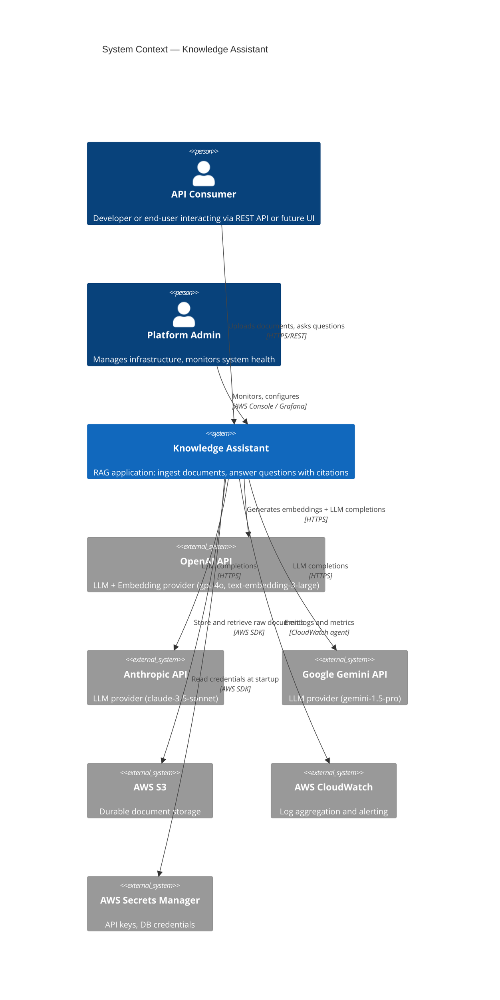
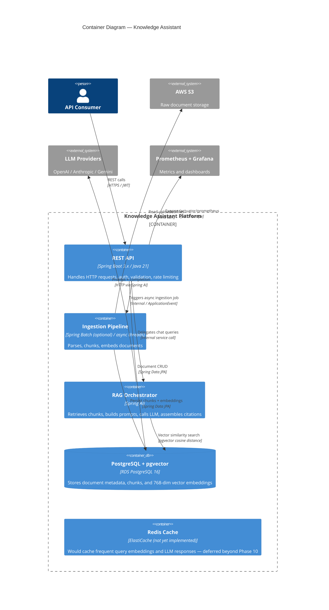
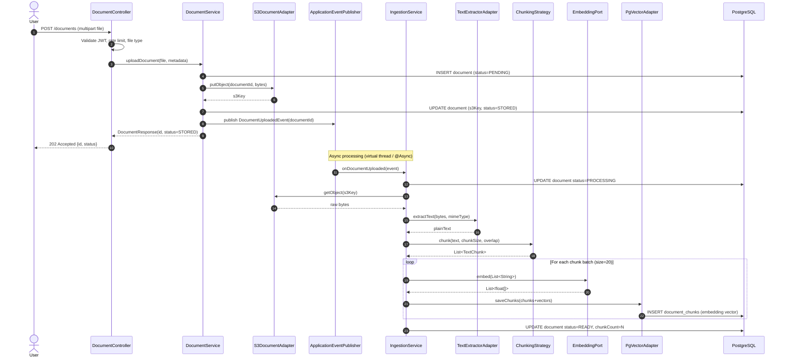
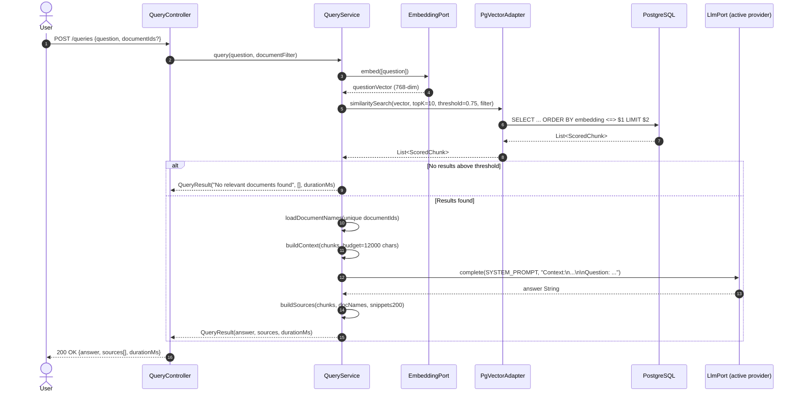
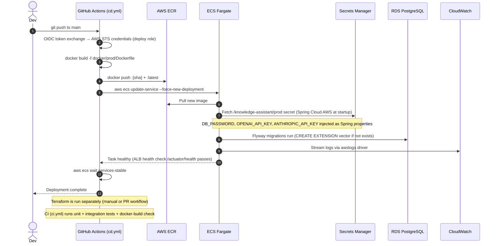
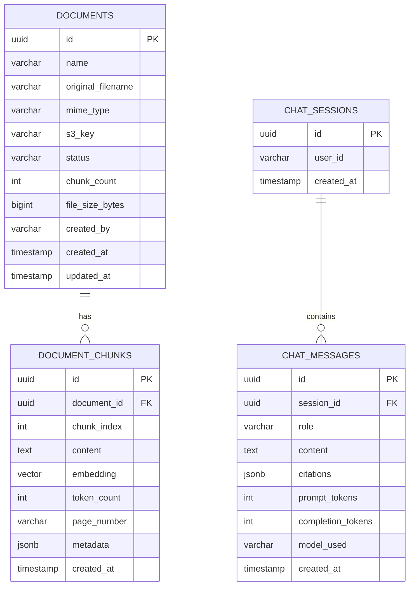
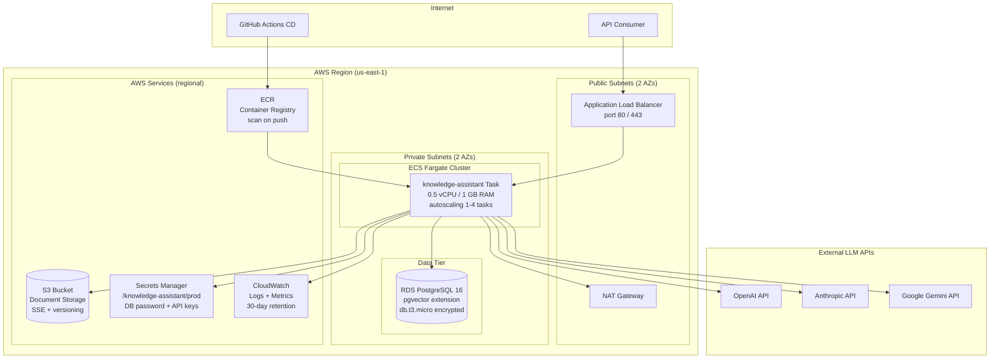

# Knowledge Assistant — Architecture Documentation

## Table of Contents
1. [System Overview](#system-overview)
2. [System Context Diagram](#system-context-diagram)
3. [Container Diagram](#container-diagram)
4. [Component Diagram](#component-diagram)
5. [Sequence Diagrams](#sequence-diagrams)
6. [RAG Pipeline Design](#rag-pipeline-design)
7. [LLM Provider Abstraction](#llm-provider-abstraction)
8. [Data Model](#data-model)
9. [Security Architecture](#security-architecture)
10. [AWS Architecture](#aws-architecture) — Terraform module graph, secrets flow, CD pipeline
11. [Observability](#observability) — metrics taxonomy, evaluation pipeline, Grafana

---

## System Overview

Knowledge Assistant is a production-grade Retrieval-Augmented Generation (RAG) system.
Users upload documents; the system ingests, chunks, embeds, and stores them.
At query time, the system retrieves semantically relevant chunks and feeds them to an LLM to produce cited answers.

**Core invariant:** the LLM never answers from its parametric knowledge alone.
Every answer must be grounded in retrieved document chunks with traceable citations.

---

## System Context Diagram



---

## Container Diagram



---

## Component Diagram

```mermaid
C4Component
    title Component Diagram — Backend Application

    Container_Boundary(api_layer, "API Layer (Adapters IN)") {
        Component(doc_ctrl, "DocumentController", "REST Controller", "Document upload, list, delete endpoints")
        Component(query_ctrl, "QueryController", "REST Controller", "POST /queries endpoint")
        Component(health_ctrl, "HealthController", "Actuator / REST", "GET /health")
        Component(auth_filter, "JwtAuthFilter", "Servlet Filter", "Validates Bearer tokens — Phase 10")
        Component(rate_limiter, "RateLimitFilter", "Servlet Filter", "Token-bucket rate limiting — Phase 10")
    }

    Container_Boundary(app_layer, "Application Layer (Use Cases)") {
        Component(doc_svc, "DocumentService", "Use Case", "Orchestrates upload → S3 store → ingestion trigger")
        Component(ingest_svc, "EmbeddingService", "Use Case", "Chunk → embed → persist pipeline")
        Component(query_svc, "QueryService", "Use Case", "Embed query → similarity search → LLM → source citations")
    }

    Container_Boundary(domain_layer, "Domain Layer (Pure Java)") {
        Component(document, "Document", "Aggregate Root", "Id, metadata, status, S3 key")
        Component(chunk, "DocumentChunk", "Entity", "Text, embedding vector, position, document ref")
        Component(query_result, "QueryResult", "Value Object", "Answer text + list of Citation VOs")
        Component(citation, "Citation", "Value Object", "ChunkId, documentId, score, excerpt")
        Component(chunk_strategy, "ChunkingStrategy", "Domain Interface", "Port for chunking implementations")
        Component(llm_port, "LlmPort", "Domain Interface", "Port for LLM completion")
        Component(embedding_port, "EmbeddingPort", "Domain Interface", "Port for vector generation")
        Component(vector_store_port, "VectorStorePort", "Domain Interface", "Port for similarity search")
        Component(doc_store_port, "DocumentStorePort", "Domain Interface", "Port for file storage")
    }

    Container_Boundary(infra_layer, "Infrastructure Layer (Adapters OUT)") {
        Component(ollama_llm, "OllamaLlmAdapter", "Spring AI", "Implements LlmPort via Ollama llama3.2 (local)")
        Component(openai_llm, "OpenAiLlmAdapter", "Spring AI", "Implements LlmPort via OpenAI gpt-4o (prod)")
        Component(anthropic_adapter, "AnthropicLlmAdapter", "Spring AI", "Implements LlmPort via Anthropic — Phase 6")
        Component(gemini_adapter, "GeminiLlmAdapter", "Spring AI", "Implements LlmPort via Gemini — Phase 6")
        Component(ollama_embed, "OllamaEmbeddingAdapter", "Spring AI", "Implements EmbeddingPort via nomic-embed-text (768 dims)")
        Component(openai_embed, "OpenAiEmbeddingAdapter", "Spring AI", "Implements EmbeddingPort via text-embedding-3-small (768 dims)")
        Component(pgvector_adapter, "PgVectorAdapter", "Spring Data JPA", "Implements VectorStorePort via pgvector cosine search")
        Component(s3_adapter, "S3DocumentAdapter", "AWS SDK v2", "Implements DocumentStorePort via S3")
        Component(jpa_repo, "DocumentJpaRepository", "Spring Data JPA", "CRUD for Document + DocumentChunk")
        Component(text_extractor, "TextExtractorAdapter", "Apache PDFBox", "Extracts text from PDF, TXT, MD")
        Component(fixed_chunk, "FixedSizeChunker", "Domain Impl", "Implements ChunkingStrategy — fixed word window with overlap")
        Component(semantic_chunk, "SemanticChunker", "Domain Impl", "Implements ChunkingStrategy — embedding similarity boundaries (Phase 10)")
    }

    Rel(doc_ctrl, doc_svc, "calls")
    Rel(query_ctrl, query_svc, "calls")
    Rel(doc_svc, ingest_svc, "triggers async")
    Rel(doc_svc, doc_store_port, "store file")
    Rel(ingest_svc, chunk_strategy, "chunk text")
    Rel(ingest_svc, embedding_port, "generate embeddings")
    Rel(ingest_svc, vector_store_port, "persist chunks+vectors")
    Rel(query_svc, embedding_port, "embed question")
    Rel(query_svc, vector_store_port, "similarity search")
    Rel(query_svc, llm_port, "complete prompt")
    Rel(s3_adapter, doc_store_port, "implements")
    Rel(pgvector_adapter, vector_store_port, "implements")
    Rel(ollama_llm, llm_port, "implements")
    Rel(openai_llm, llm_port, "implements")
    Rel(anthropic_adapter, llm_port, "implements")
    Rel(gemini_adapter, llm_port, "implements")
    Rel(ollama_embed, embedding_port, "implements")
    Rel(openai_embed, embedding_port, "implements")
```



---

## Sequence Diagrams

### Document Upload & Ingestion



### RAG Query



### AWS Deployment (CD Pipeline)



---

## RAG Pipeline Design

### Chunking Strategies

| Strategy | Description | Best For | Tradeoff |
|---|---|---|---|
| **Fixed-size** | Split on token count with overlap | Simple docs, fast ingestion | May split sentences mid-thought |
| **Sentence-boundary** | Split at sentence boundaries within window | General purpose | Slight complexity |
| **Semantic** | Split where embedding similarity drops | Dense technical docs | Expensive — 2× embedding calls |
| **Recursive character** | LangChain-style, tries larger → smaller separators | Code + prose | Good default |

**Implementation:** Fixed-size (512 tokens, 64 overlap) — shipped in Phase 4. Semantic chunking deferred to Phase 10.

### Embedding Model Selection

| Model | Provider | Dimensions | Cost | Notes |
|---|---|---|---|---|
| `nomic-embed-text` | Ollama (local) | 768 | Free | Default for local dev; no API key needed |
| `text-embedding-3-small` | OpenAI | 768 | $0.02/1M tokens | Configured to 768 dims to match nomic-embed-text |
| `text-embedding-3-large` | OpenAI | 3072 | $0.13/1M tokens | Higher quality but incompatible vector size |

**Rule:** embedding model must be **immutable** after first ingestion. Changing model or dimensions requires a full re-embed of all documents — vector spaces are model-specific and not interchangeable.

### Vector Index Strategy

```sql
-- IVFFlat: good for < 1M vectors, fast build
CREATE INDEX ON document_chunks USING ivfflat (embedding vector_cosine_ops) WITH (lists = 100);

-- HNSW: better recall, higher memory, better for > 1M vectors
CREATE INDEX ON document_chunks USING hnsw (embedding vector_cosine_ops) WITH (m = 16, ef_construction = 64);
```

**Phase 2 default:** HNSW. More memory but better recall and no training step required.

### Hybrid Search (Phase 7+ evolution)

```
score = α × vector_similarity + (1-α) × bm25_score
```

Requires `pg_trgm` or `ts_vector` full-text search alongside pgvector. Significantly improves recall for keyword-heavy queries.

### Reranking (Phase 7+ evolution)

After retrieving top-K=20 via vector search, pass all 20 chunks through a cross-encoder reranker (Cohere Rerank API or local model), then take top-K=5 for the prompt. Dramatically improves precision at the cost of ~200ms latency.

---

## LLM Provider Abstraction

The `LlmPort` domain interface decouples the application from any specific provider:

```
LlmPort
  └── OllamaLlmAdapter     (Spring AI Ollama — llama3.2 local, app.llm.provider=ollama)
  └── OpenAiLlmAdapter     (Spring AI OpenAI — gpt-4o prod, app.llm.provider=openai)
  └── AnthropicLlmAdapter  (Spring AI Anthropic — claude-sonnet-4-6, Phase 6)
  └── GeminiLlmAdapter     (Spring AI Google Vertex/Gemini, Phase 6)
```

Provider selection is driven by `app.llm.provider=ollama|openai|anthropic|gemini` in application config.
Spring `@ConditionalOnProperty` activates the correct `@Bean`.

`EmbeddingPort` follows the same pattern independently — LLM and embedding providers are configured
and switched separately. For example, `app.embedding.provider=ollama` + `app.llm.provider=openai`
is a valid combination for production (free local embeddings + high-quality cloud LLM).

**When to use AWS Bedrock instead:**
- You are already in AWS and want to avoid external egress
- Compliance requires all data to stay within your AWS VPC (use Bedrock VPC endpoints)
- You want unified IAM-based auth instead of managing API keys
- You need access to Titan Embeddings for cost-optimized embedding at scale
- Bedrock supports Claude, Llama, Titan — if your org already uses Claude via Anthropic API, Bedrock lets you avoid a second vendor relationship

---

## Data Model



---

## Security Architecture

```
Request → TLS Termination (ALB)
        → ApiKeyAuthFilter (X-API-Key header validation)
        │     Dev mode: api-keys empty → pass-through (no auth required)
        │     Prod mode: validates against app.security.api-keys from Secrets Manager
        → RateLimiter (Resilience4j @RateLimiter — 20 req/10s on /queries and /sessions/*/messages)
        → Controller
        → Application Layer
        → Infrastructure (credentials from Secrets Manager, never env vars in prod)
```

- **API keys:** `X-API-Key` header; comma-separated list in `app.security.api-keys` supports zero-downtime rotation. Upgrade path to JWT documented in `docs/PHASE_10_RUNBOOK.md`.
- **Secrets:** Never hardcode. Dev: `application-local.yml` (gitignored) + LocalStack SM. Prod: Secrets Manager via Spring Cloud AWS (`spring.config.import: aws-secretsmanager:/knowledge-assistant/prod`).
- **S3:** Documents stored server-side encrypted; app accesses via task role (no credentials in app code).
- **DB:** RDS in private subnet, no public access; Security Group allows only ECS tasks on port 5432.

### Resilience

```
LlmPort.complete()
  → @CircuitBreaker(name="llm")  — opens at 50% failure rate in 10s window
  │     fallback: returns LlmResponse("The AI service is temporarily unavailable...", 0, 0, "unavailable")
  → @Retry(name="llm")           — 3 attempts, exponential backoff 2s/4s
  │     only retries: ResourceAccessException, ConnectException, IOException
  → actual LLM HTTP call (OpenAI / Anthropic / Ollama)
```

Circuit breaker state transitions:
- **CLOSED** → **OPEN**: 50% failure rate over minimum 5 calls in a 10s sliding window
- **OPEN** → **HALF_OPEN**: automatic after 30s; probes with 3 calls
- **HALF_OPEN** → **CLOSED**: all 3 probe calls succeed
- **HALF_OPEN** → **OPEN**: any probe call fails

This pattern ensures LLM provider outages degrade gracefully (users see a clear message, not a 500) and recovers automatically without operator intervention.

---

## AWS Architecture



### Terraform Module Dependency Graph

```
bootstrap/          ← run once; creates S3 + DynamoDB for remote state
environments/prod/
  ├── vpc           ← VPC, subnets, IGW, NAT Gateway, route tables
  ├── security      ← ALB / ECS / RDS security groups (depends: vpc)
  ├── ecr           ← container registry (no dependencies)
  ├── rds           ← PostgreSQL 16, random_password (depends: vpc, security)
  ├── s3            ← document bucket (no dependencies)
  ├── secrets       ← SM secret with rds.db_password output (depends: rds)
  ├── iam           ← roles using secrets.secret_arn, s3.bucket_arn (depends: secrets, s3)
  ├── alb           ← load balancer (depends: vpc, security)
  └── ecs           ← cluster + service wiring everything together (depends: all above)
```

### Secrets Flow (Spring Cloud AWS)

```
ECS task starts
  │
  ├─ SPRING_PROFILES_ACTIVE=prod → Spring loads application-prod.yml
  │
  ├─ spring.config.import: aws-secretsmanager:/knowledge-assistant/prod
  │     → Spring Cloud AWS calls SM GetSecretValue
  │     → JSON keys injected as Spring properties:
  │           DB_PASSWORD      → resolves ${DB_PASSWORD:ka_password} in application.yml
  │           OPENAI_API_KEY   → resolves ${OPENAI_API_KEY:}
  │           ANTHROPIC_API_KEY → resolves ${ANTHROPIC_API_KEY:}
  │
  ├─ DB_URL set as plaintext env var in ECS task def (not sensitive: just hostname + db name)
  │
  ├─ Flyway runs: CREATE EXTENSION IF NOT EXISTS vector (pgvector activated)
  │
  └─ /actuator/health → UP → ALB marks task healthy → traffic routed
```

---

## Observability

### Metrics Taxonomy

All custom metrics live in the **application layer** (`QueryService`, `EmbeddingService`, `IngestionService`, `EvaluationService`). `MeterRegistry` is injected via constructor — not in domain (ArchUnit enforced), not in infrastructure adapters (insufficient business context for tagging).

```
Operational metrics (what is the system doing?)
│
├── chat.query.duration          [Timer]              tag: provider
│     End-to-end RAG pipeline latency
│
├── llm.completion.duration      [Timer]              tag: provider
│     LLM call in isolation — reveals LLM's share of tail latency
│
├── similarity.search.results    [DistributionSummary] tag: outcome=found|not_found
│     Count of chunks returned; outcome tag tracks hit/miss rate
│
├── embedding.generation.duration [Timer]             tag: batch_size
│     Embedding batch latency; batch_size exposes non-linear scaling
│
├── ingestion.pipeline.duration   [Timer]             tag: status=success|failure
│     Full per-document pipeline; failure tag splits the distribution
│
└── document.ingested             [Counter]           tag: status=success|failure
      Monotonically increasing total; rate() gives ingestion throughput

Quality metrics (are the answers good?)
│
├── rag.evaluation.faithfulness   [DistributionSummary] tag: provider
│     LLM judge score 0–1: answer claims supported by retrieved context
│
└── rag.evaluation.answer_relevance [DistributionSummary] tag: provider
      LLM judge score 0–1: answer addresses the question
```

**Why these types:**
- **Timer**: captures duration + rate in one instrument (`_count`, `_sum`, `_bucket`). Any "how long did X take?" is a timer.
- **DistributionSummary**: like Timer but for non-time values. Chunk counts and quality scores (0–1 floats) are not durations.
- **Counter**: monotonically increasing event count. Latency is irrelevant for "how many documents were ingested."
- **Gauge** (not used): current point-in-time value (queue depth, pool size). None of the above are instantaneous readings.

**Tag cardinality rule**: all tags are low-cardinality. `provider` (3–4 values), `status`/`outcome` (2 values each), `batch_size` (bounded by `app.embedding.batch-size`). Never tag with document IDs, session IDs, or question text.

### LLM-as-a-Judge Evaluation Pipeline

```
QueryService.query() completes
  │
  └─ evaluationService.evaluate(question, context, answer)
       │  (async fire-and-forget via @Async("evaluationTaskExecutor"))
       │  (sampled: only fires for app.evaluation.sample-rate fraction of calls)
       │
       ├─ llmPort.complete(FAITHFULNESS_SYSTEM_PROMPT, faithfulnessUserPrompt)
       │     → parse 0.0–1.0 float → clamp → record rag.evaluation.faithfulness
       │
       └─ llmPort.complete(RELEVANCE_SYSTEM_PROMPT, relevanceUserPrompt)
             → parse 0.0–1.0 float → clamp → record rag.evaluation.answer_relevance

Exceptions: caught and logged as WARN — never propagate to the query caller
Non-numeric responses: fall back to 0.5 (neutral) + WARN log
```

**Why this doesn't block users:** `EvaluationService.evaluate()` is annotated `@Async("evaluationTaskExecutor")`. When `QueryService` calls it, Spring's AOP proxy intercepts the call and dispatches it to the evaluation virtual-thread executor. Control returns to `QueryService` immediately; the user's response is returned before the judge calls even begin.

### Grafana Dashboard

Locally available via `docker compose -f docker/local/docker-compose.yml --profile monitoring up -d`.

Auto-provisioned from:
- `docker/local/grafana/provisioning/datasources/prometheus.yml` — Prometheus datasource (uid: `prometheus`, url: `http://prometheus:9090`)
- `docker/local/grafana/provisioning/dashboards/dashboard.yml` — scans `/var/lib/grafana/dashboards`
- `docker/local/grafana/dashboards/knowledge-assistant.json` — 8-panel dashboard

| Panel | What it reveals |
|---|---|
| Query rate | Traffic volume; spot traffic spikes |
| Query P95 latency | End-to-end user-perceived latency |
| LLM P95 latency | LLM's share of query latency; identifies provider-specific slowdowns |
| Search outcomes | Retrieval hit rate — `not_found` spike = docs missing or threshold too high |
| Ingestion pipeline | Success/failure ratio; spot embedding provider errors |
| Embedding latency by batch | Non-linear scaling signal; informs batch-size tuning |
| Faithfulness P50 | Rolling median answer grounding; persistent < 0.7 = prompt or retrieval problem |
| Answer relevance P50 | Rolling median relevance; persistent < 0.7 = off-topic answers |

### CloudWatch Alarms (AWS, applied via Terraform)

| Alarm | Condition | Action |
|---|---|---|
| ECS CPU high | > 80% for 2 × 5-min periods | SNS → email |
| Service down | Running tasks < 1 | SNS → email (immediate) |
| 5xx errors | ALB 5xx count > 10 in 5 min | SNS → email |
