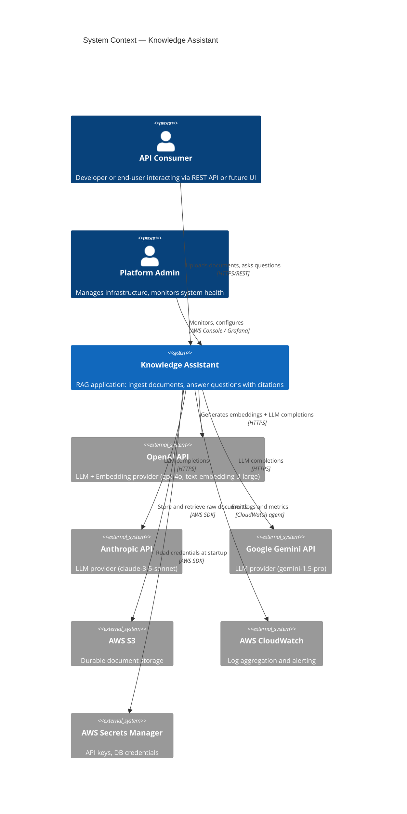
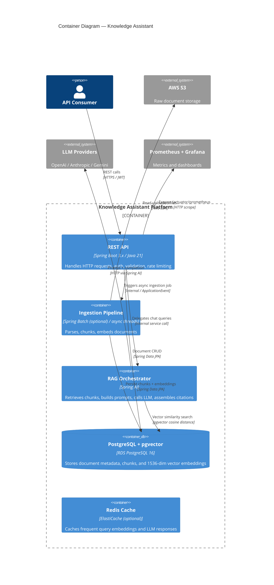
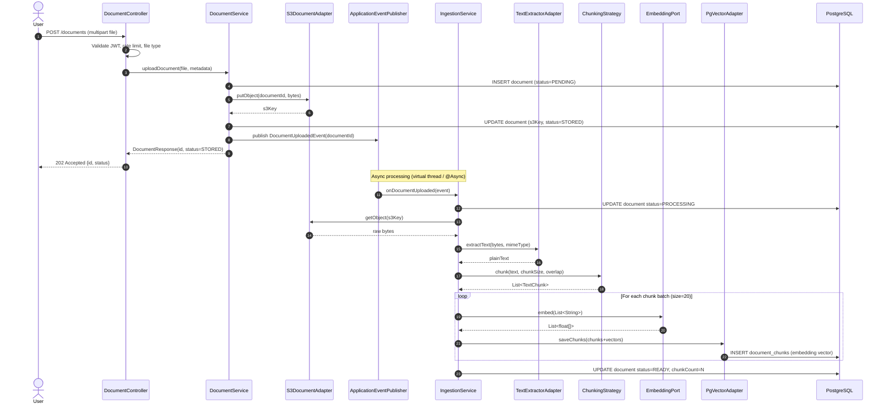
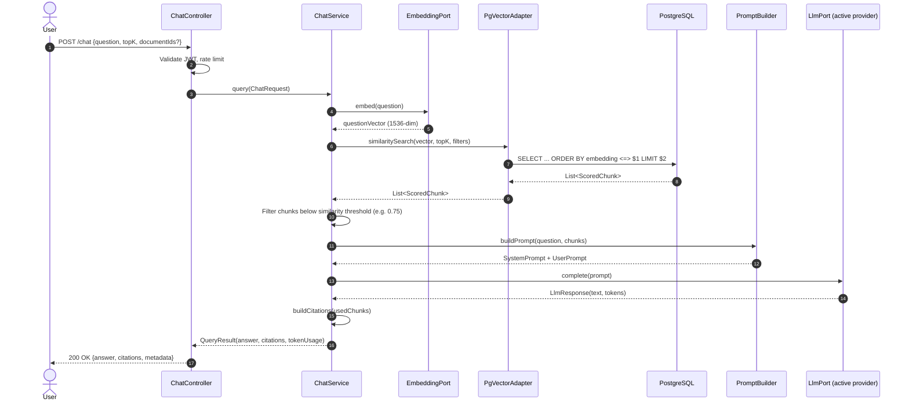
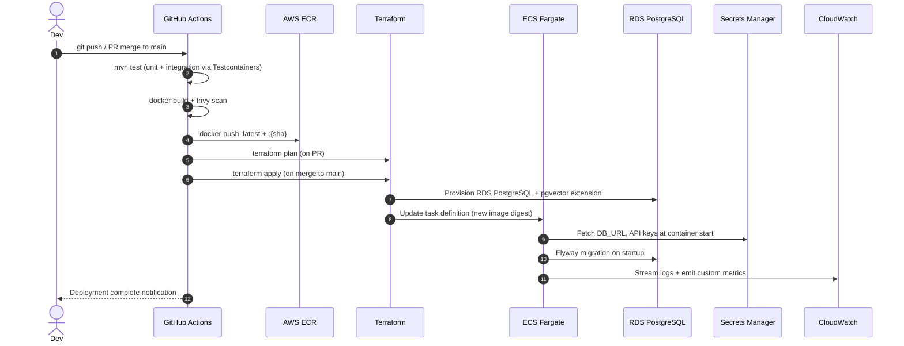
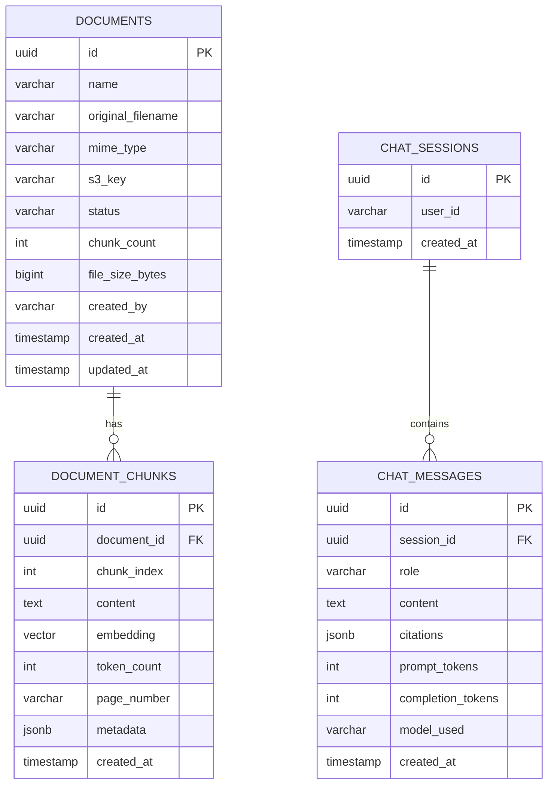
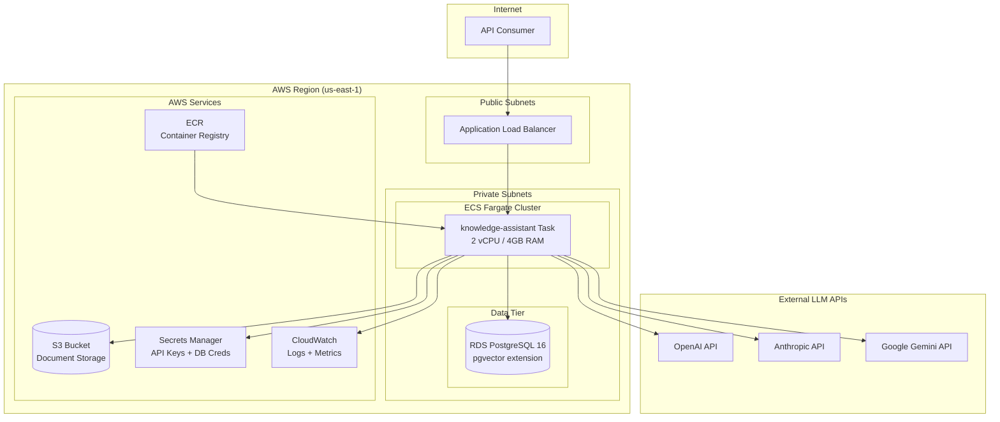

# Knowledge Assistant — Architecture Documentation

## Table of Contents
1. [System Overview](#system-overview)
2. [System Context Diagram](#system-context-diagram)
3. [Container Diagram](#container-diagram)
4. [Component Diagram](#component-diagram)
5. [Sequence Diagrams](#sequence-diagrams)
6. [RAG Pipeline Design](#rag-pipeline-design)
7. [LLM Provider Abstraction](#llm-provider-abstraction)
8. [Data Model](#data-model)
9. [Security Architecture](#security-architecture)
10. [AWS Architecture](#aws-architecture)

---

## System Overview

Knowledge Assistant is a production-grade Retrieval-Augmented Generation (RAG) system.
Users upload documents; the system ingests, chunks, embeds, and stores them.
At query time, the system retrieves semantically relevant chunks and feeds them to an LLM to produce cited answers.

**Core invariant:** the LLM never answers from its parametric knowledge alone.
Every answer must be grounded in retrieved document chunks with traceable citations.

---

## System Context Diagram



---

## Container Diagram



---

## Component Diagram

```mermaid
C4Component
    title Component Diagram — Backend Application

    Container_Boundary(api_layer, "API Layer (Adapters IN)") {
        Component(doc_ctrl, "DocumentController", "REST Controller", "Document upload, list, delete endpoints")
        Component(chat_ctrl, "ChatController", "REST Controller", "POST /chat endpoint")
        Component(embed_ctrl, "EmbeddingController", "REST Controller", "POST /embeddings/rebuild")
        Component(health_ctrl, "HealthController", "Actuator / REST", "GET /health")
        Component(auth_filter, "JwtAuthFilter", "Servlet Filter", "Validates Bearer tokens")
        Component(rate_limiter, "RateLimitFilter", "Servlet Filter", "Token-bucket rate limiting per API key")
    }

    Container_Boundary(app_layer, "Application Layer (Use Cases)") {
        Component(doc_svc, "DocumentService", "Use Case", "Orchestrates upload → S3 store → ingestion trigger")
        Component(ingest_svc, "IngestionService", "Use Case", "Chunk → embed → persist pipeline")
        Component(chat_svc, "ChatService", "Use Case", "Embed query → retrieve → prompt → LLM → cite")
        Component(embed_svc, "EmbeddingService", "Use Case", "Rebuild embeddings for existing docs")
    }

    Container_Boundary(domain_layer, "Domain Layer (Pure Java)") {
        Component(document, "Document", "Aggregate Root", "Id, metadata, status, S3 key")
        Component(chunk, "DocumentChunk", "Entity", "Text, embedding vector, position, document ref")
        Component(query_result, "QueryResult", "Value Object", "Answer text + list of Citation VOs")
        Component(citation, "Citation", "Value Object", "ChunkId, documentId, score, excerpt")
        Component(chunk_strategy, "ChunkingStrategy", "Domain Interface", "Port for chunking implementations")
        Component(llm_port, "LlmPort", "Domain Interface", "Port for LLM completion")
        Component(embedding_port, "EmbeddingPort", "Domain Interface", "Port for vector generation")
        Component(vector_store_port, "VectorStorePort", "Domain Interface", "Port for similarity search")
        Component(doc_store_port, "DocumentStorePort", "Domain Interface", "Port for file storage")
    }

    Container_Boundary(infra_layer, "Infrastructure Layer (Adapters OUT)") {
        Component(openai_adapter, "OpenAiAdapter", "Spring AI", "Implements LlmPort + EmbeddingPort via OpenAI")
        Component(anthropic_adapter, "AnthropicAdapter", "Spring AI", "Implements LlmPort via Anthropic")
        Component(gemini_adapter, "GeminiAdapter", "Spring AI", "Implements LlmPort via Gemini")
        Component(pgvector_adapter, "PgVectorAdapter", "Spring AI / JPA", "Implements VectorStorePort via pgvector")
        Component(s3_adapter, "S3DocumentAdapter", "AWS SDK v2", "Implements DocumentStorePort via S3")
        Component(jpa_repo, "DocumentJpaRepository", "Spring Data JPA", "CRUD for Document + DocumentChunk")
        Component(text_extractor, "TextExtractorAdapter", "Apache PDFBox / Tika", "Extracts text from PDF, TXT, MD")
        Component(fixed_chunk, "FixedSizeChunker", "Domain Impl", "Implements ChunkingStrategy — fixed token window")
        Component(semantic_chunk, "SemanticChunker", "Domain Impl", "Implements ChunkingStrategy — embedding similarity boundaries")
    }

    Rel(doc_ctrl, doc_svc, "calls")
    Rel(chat_ctrl, chat_svc, "calls")
    Rel(embed_ctrl, embed_svc, "calls")
    Rel(doc_svc, ingest_svc, "triggers async")
    Rel(doc_svc, doc_store_port, "store file")
    Rel(ingest_svc, chunk_strategy, "chunk text")
    Rel(ingest_svc, embedding_port, "generate embeddings")
    Rel(ingest_svc, vector_store_port, "persist chunks+vectors")
    Rel(chat_svc, embedding_port, "embed query")
    Rel(chat_svc, vector_store_port, "similarity search")
    Rel(chat_svc, llm_port, "complete prompt")
    Rel(s3_adapter, doc_store_port, "implements")
    Rel(pgvector_adapter, vector_store_port, "implements")
    Rel(openai_adapter, llm_port, "implements")
    Rel(openai_adapter, embedding_port, "implements")
    Rel(anthropic_adapter, llm_port, "implements")
    Rel(gemini_adapter, llm_port, "implements")
```



---

## Sequence Diagrams

### Document Upload & Ingestion



### Chat / RAG Query



### AWS Deployment



---

## RAG Pipeline Design

### Chunking Strategies

| Strategy | Description | Best For | Tradeoff |
|---|---|---|---|
| **Fixed-size** | Split on token count with overlap | Simple docs, fast ingestion | May split sentences mid-thought |
| **Sentence-boundary** | Split at sentence boundaries within window | General purpose | Slight complexity |
| **Semantic** | Split where embedding similarity drops | Dense technical docs | Expensive — 2× embedding calls |
| **Recursive character** | LangChain-style, tries larger → smaller separators | Code + prose | Good default |

**Implementation plan:** Start with fixed-size (512 tokens, 64 overlap). Add semantic chunking in Phase 7.

### Embedding Model Selection

| Model | Dimensions | Cost | Quality | Notes |
|---|---|---|---|---|
| `text-embedding-3-small` | 1536 | $0.02/1M tokens | Good | Default choice |
| `text-embedding-3-large` | 3072 | $0.13/1M tokens | Best | Use for production |
| `text-embedding-ada-002` | 1536 | $0.10/1M tokens | Good | Legacy, avoid for new |

**Rule:** embedding model must be **immutable** after first ingestion. Changing it requires a full re-embed (the `/embeddings/rebuild` endpoint exists for this).

### Vector Index Strategy

```sql
-- IVFFlat: good for < 1M vectors, fast build
CREATE INDEX ON document_chunks USING ivfflat (embedding vector_cosine_ops) WITH (lists = 100);

-- HNSW: better recall, higher memory, better for > 1M vectors
CREATE INDEX ON document_chunks USING hnsw (embedding vector_cosine_ops) WITH (m = 16, ef_construction = 64);
```

**Phase 2 default:** HNSW. More memory but better recall and no training step required.

### Hybrid Search (Phase 7+ evolution)

```
score = α × vector_similarity + (1-α) × bm25_score
```

Requires `pg_trgm` or `ts_vector` full-text search alongside pgvector. Significantly improves recall for keyword-heavy queries.

### Reranking (Phase 7+ evolution)

After retrieving top-K=20 via vector search, pass all 20 chunks through a cross-encoder reranker (Cohere Rerank API or local model), then take top-K=5 for the prompt. Dramatically improves precision at the cost of ~200ms latency.

---

## LLM Provider Abstraction

The `LlmPort` domain interface decouples the application from any specific provider:

```
LlmPort
  └── OpenAiAdapter     (Spring AI OpenAI chat client)
  └── AnthropicAdapter  (Spring AI Anthropic chat client)
  └── GeminiAdapter     (Spring AI Google Vertex/Gemini client)
```

Provider selection is driven by `app.llm.provider=openai|anthropic|gemini` in application config.
Spring `@ConditionalOnProperty` activates the correct `@Bean`.

**When to use AWS Bedrock instead:**
- You are already in AWS and want to avoid external egress
- Compliance requires all data to stay within your AWS VPC (use Bedrock VPC endpoints)
- You want unified IAM-based auth instead of managing API keys
- You need access to Titan Embeddings for cost-optimized embedding at scale
- Bedrock supports Claude, Llama, Titan — if your org already uses Claude via Anthropic API, Bedrock lets you avoid a second vendor relationship

---

## Data Model



---

## Security Architecture

```
Request → TLS Termination (ALB)
        → JwtAuthFilter (RS256 JWT validation)
        → RateLimitFilter (per API key, token bucket)
        → Controller
        → Application Layer
        → Infrastructure (credentials from Secrets Manager, never env vars in prod)
```

- **JWT:** RS256, short-lived (15 min access token), supports API key as alternative
- **Secrets:** Never hardcode. Dev: `application-local.yml` (gitignored). Prod: Secrets Manager via Spring Cloud AWS
- **S3:** Pre-signed URLs for download, never expose raw S3 URLs
- **DB:** RDS in private subnet, no public access, Security Group allows only ECS tasks

---

## AWS Architecture


